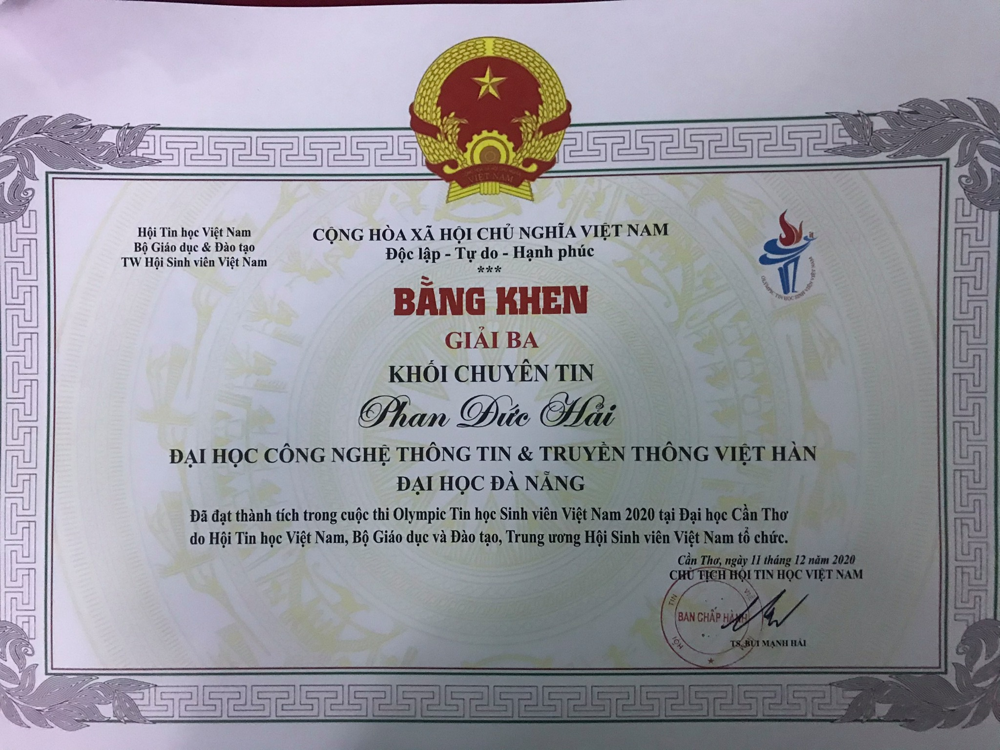

# Unit 3

## Vocabulary

| English | | Vietnamese |
| :-: |:-: |:-: |
| Like| Verb  | Thích|
|Love|Verb |Thích / Yêu|
|Hate|Verb | Ghét|
|Enjoy| Verb  | Thích|
|Enjoyable| Adjective | Thú vị|
|Prefer| Verb  | Thích hơn|
|Interested| Adjective | Thích thú|
|Interesting| Adjective | Hay ho |
|Found| Adjective | Thích thú|
|Into| Adjective | Hứng thú|
|Wonderful| ...|...|
|Fun|...|...|
|Favorite| Adjective | Yêu thích|
||||

## Answer the question

#### 1. Do you think driving a car is instresting?
- No, I don't feel like driving. I usually ride a motorbike, so when I go out on the street I have to endure uncomfortable things such as hot sun and dust. If I had a car, I think driving would be more enjoyable.

#### 2. Is learning English good fun?
- Learning English is good fun. It helps a lot in my future work. I met many new friends in English class. And especially to meet Mr. Tu, a teacher who is passionate about the profession.

#### 3. What is your favorite city?
- My favorite city is Ha Tinh. That is my hometown. The city suffered many fierce storms, where it was subjected to the heat of the Lao wind. However, Ha Tinh has many beautiful scenes and many famous specialties such as cudo candy. It is too difficult to describe the city that I love in a short paragraph because it is so beautiful and wonderful.

#### 4. Are you intrested in sport?
- My favorite sport is moblie league, it's an e-sport. When I play it I can relieve my stress. I often play with my friends, it's also a way for us to bond. Besides, I also love other sports like badminton and running.

#### 5. Are you keen in rap music?
- I keed rap music. I often listen to rap music on youtube. I like the charm in this genre of music. I like the lyrics of rap songs, it's usually very good and meaningful.

#### 6. Do you think cooking is enjoyable?
- I find cooking enjoyable, possibly because I enjoy eating more than cooking. Although a lot of me love to cook my favorite dishes by myself, sometimes it's not that good.

## Describe the picture
##### Picture

  

#### Describe

This is my favorite photo. It is a testament to the achievement that comes from my passion. My passion is writing code for computer programs. Looking at the photo, everyone can see my efforts, to achieve this result I had to stay up every night to practice. It would be an achievement that I can be proud of.
